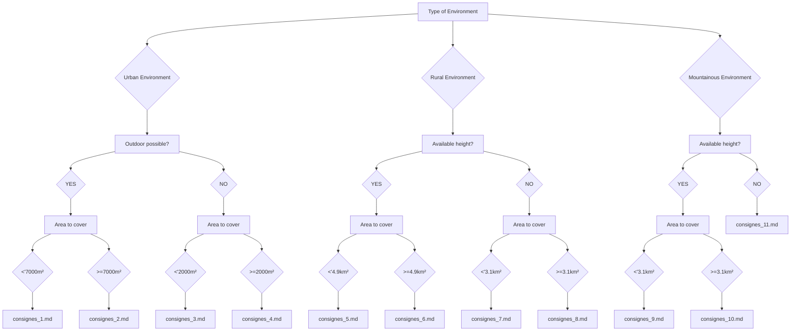

```mermaid
graph TD
    EnvironmentType["Type of Environment"] 

    Urban{"Urban Environment"}
    Rural{"Rural Environment"}
    Mountainous{"Mountainous Environment"}
    
    EnvironmentType --> Urban
    EnvironmentType --> Rural
    EnvironmentType --> Mountainous

    OutdoorPossible["Outdoor possible?"]
    HeightAvailableRural["Available height?"]
    HeightAvailableMountain["Available height?"]

    Urban --> OutdoorPossible
    Rural --> HeightAvailableRural
    Mountainous --> HeightAvailableMountain

    OutdoorYes{"YES"}
    OutdoorNo{"NO"}
    HeightRuralYes{"YES"}
    HeightRuralNo{"NO"}
    HeightMountainYes{"YES"}
    HeightMountainNo{"NO"}

    OutdoorPossible --> OutdoorYes
    OutdoorPossible --> OutdoorNo
    HeightAvailableRural --> HeightRuralYes
    HeightAvailableRural --> HeightRuralNo
    HeightAvailableMountain --> HeightMountainYes
    HeightAvailableMountain --> HeightMountainNo

    AreaUrbanOutdoor["Area to cover"]
    AreaUrbanIndoor["Area to cover"]
    AreaRuralOutdoor["Area to cover"]
    AreaRuralIndoor["Area to cover"]
    AreaMountainOutdoor["Area to cover"]

    OutdoorYes --> AreaUrbanOutdoor
    OutdoorNo --> AreaUrbanIndoor
    HeightRuralYes --> AreaRuralOutdoor
    HeightRuralNo --> AreaRuralIndoor
    HeightMountainYes --> AreaMountainOutdoor

    SmallUrbanOutdoor{"<'7000m²"}
    LargeUrbanOutdoor{">=7000m²"}
    SmallUrbanIndoor{"<'2000m²"}
    LargeUrbanIndoor{">=2000m²"}
    SmallRuralOutdoor{"<'4.9km²"}
    LargeRuralOutdoor{">=4.9km²"}
    SmallRuralIndoor{"<'3.1km²"}
    LargeRuralIndoor{">=3.1km²"}
    SmallMountainOutdoor{"<'3.1km²"}
    LargeMountainOutdoor{">=3.1km²"}

    AreaUrbanOutdoor --> SmallUrbanOutdoor
    AreaUrbanOutdoor --> LargeUrbanOutdoor
    AreaUrbanIndoor --> SmallUrbanIndoor
    AreaUrbanIndoor --> LargeUrbanIndoor
    AreaRuralOutdoor --> SmallRuralOutdoor
    AreaRuralOutdoor --> LargeRuralOutdoor
    AreaRuralIndoor --> SmallRuralIndoor
    AreaRuralIndoor --> LargeRuralIndoor
    AreaMountainOutdoor --> SmallMountainOutdoor
    AreaMountainOutdoor --> LargeMountainOutdoor

    SmallUrbanOutdoor --> Instructions1["consignes_1.md"]
    LargeUrbanOutdoor --> Instructions2["consignes_2.md"]
    SmallUrbanIndoor --> Instructions3["consignes_3.md"]
    LargeUrbanIndoor --> Instructions4["consignes_4.md"]
    SmallRuralOutdoor --> Instructions5["consignes_5.md"]
    LargeRuralOutdoor --> Instructions6["consignes_6.md"]
    SmallRuralIndoor --> Instructions7["consignes_7.md"]
    LargeRuralIndoor --> Instructions8["consignes_8.md"]
    SmallMountainOutdoor --> Instructions9["consignes_9.md"]
    LargeMountainOutdoor --> Instructions10["consignes_10.md"]
    HeightMountainNo --> Instructions11["consignes_11.md"]


```
