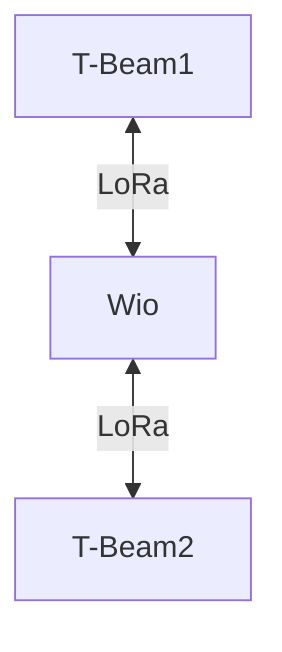

# Tests in Mountainous Environments

## 1. Objective
Evaluate LoRa communication in mountainous environments using relays and varying characteristics:
- Area to cover
- Height
- Use of relays

Here, 868 MHz antennas will be used as they offer better range in low-density environments.  
The objective is to determine the optimal placement of relays.

## 2. Equipment Used
- 2x **T-BEAM Supreme** (ESP32 + LoRa)
- 868 MHz antennas
- 1x Wio-WM1110
- Bluetooth connection with **Meshtastic API**

## 3. Test Topology

## 4. Test Scenarios  
The different scenarios can be found in the file `/src/test/images/planification_tests.pdf`.

Our 2 tests aim to evaluate the criteria described in the objective section.

All tests were conducted in the same way: 2 endpoints communicate, and one moves forward while the distance between them is recorded at the point where communication is lost.

### First Test
In this test, the two endpoints start in direct communication but quickly end up on opposite sides of the mountain.

### Second Test
In this test, the two endpoints are in direct communication with the WIO relay but cannot communicate directly with each other.

## Results

|Direct Communication|Relay in Direct Communication|Maximum Communication Distance|
|-|-|-|
|NO|NO|Communication impossible|
|NO|YES|2,000m|

## Conclusions

The results show that in mountainous environments, two endpoints separated by a mountain cannot communicate directly, even over short distances. The terrain acts as an insurmountable obstacle for the LoRa signal, despite the use of long-range 868 MHz antennas. Using a relay restores communication, but only if it has a clear line of sight with both endpoints. Therefore, to ensure reliable coverage in rugged terrain, it is essential to place relays at the top of mountains, where they can provide a clear link between different areas of the network.