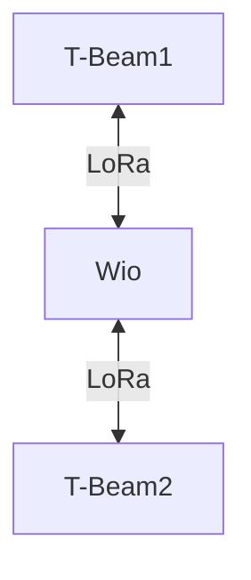

# Tests in Rural Environments

## 1. Objective
Evaluate LoRa communication in rural environments using relays and varying characteristics:
- Area to cover
- Height
- Use of relays

Here, 868 MHz antennas will be used as they offer better range in low-density environments.  
The objective is to determine the optimal placement of relays.

## 2. Equipment Used
- 2x **T-BEAM Supreme** (ESP32 + LoRa)
- 868 MHz antennas
- 1x Wio-WM1110
- Bluetooth connection with **Meshtastic API**

## 3. Test Topology

## 4. Test Scenarios  
The different scenarios can be found in the file `/src/test/images/planification_tests.pdf`.

Our 2 tests aim to evaluate the criteria described in the objective section.

All tests were conducted in the same way: 2 endpoints communicate, and one moves forward while the distance between them is recorded at the point where communication is lost.

### First Test
In this test, the two endpoints communicate first through relays placed on the ground.  
The test is then repeated with the relays placed at a height (on top of a tree ~6m).

## Results

|Relay at Height|Maximum Communication Distance|
|-|-|
|NO|2,000m|
|YES|2,500m|

## Conclusions

In rural environments, LoRa communication performance is excellent due to the low density of obstacles, with ranges already reaching 2 km even with relays on the ground. However, the results show that placing the relays at a height (here at only 6 m) can improve the range up to 2.5 km. This confirms that in an open environment, the main optimization factor remains the height of the relays. Whenever possible, it is strongly recommended to install them at a height (trees, roofs, masts) to fully leverage LoRa's capabilities in rural areas.