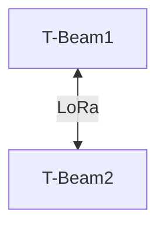

# Tests in Urban Environments

## 1. Objective
Evaluate LoRa communication in urban environments (high density) by varying the following characteristics:
- Outdoor / Indoor
- Area to cover
- Height
- Building density

Here, 433 MHz antennas will be used as they offer better penetration in dense environments.

## 2. Equipment Used
- 2x **T-BEAM Supreme** (ESP32 + LoRa)
- 433 MHz antennas
- Bluetooth connection with **Meshtastic API**

## 3. Test Topology

## 4. Test Scenarios  
The different scenarios can be found in the file `/src/test/images/planification_tests.pdf`.

Our 6 tests aim to evaluate the criteria described in the objective section.

All tests were conducted in the same way: 2 endpoints communicate, and one moves forward while the distance between them is recorded at the point where communication is lost.

All tests were performed twice, once with the antennas placed indoors and once outdoors.

### First Test
In this test, the building density is low, and the height is medium (8m for endpoint 1, 1m for endpoint 2).

### Second Test
In this test, the building density is medium, and the height is high (15m for endpoint 1, 1m for endpoint 2).

### Third Test
In this test, the building density is high, and the height is medium (8m for endpoint 1, 1m for endpoint 2).

## Results

|Height|Density|Outdoor|Maximum Communication Distance|
|-|-|-|-|
|Medium|Low|NO|200m|
|Medium|Low|YES|300m|
|High|Medium|NO|150m|
|High|Medium|YES|250m|
|Medium|High|NO|50m|
|Medium|High|YES|100m|

## Conclusions

These tests highlight the practical limitations of LoRa technology in dense urban environments, despite the use of 433 MHz antennas. A significant degradation in performance is observed in highly built-up areas, emphasizing the importance of adapting node placement to the terrain. Rather than aiming for uniform coverage, it would be more effective to consider a dense mesh architecture or the addition of strategic relays. This approach would help maintain network reliability even under less-than-ideal conditions by focusing more on resilience than on raw range.