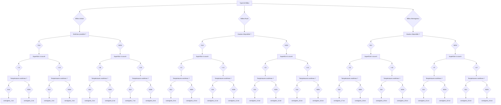

```mermaid
graph TD
    Milieu["Type de Milieu"] 

    Urbain{"Milieu Urbain"}
    Rural{"Milieu Rural"}
    Montagneux{"Milieu Montagneux"}
    
    Milieu --> Urbain
    Milieu --> Rural
    Milieu --> Montagneux

    ExtPossible["Extérieur possible ?"]
    HauteurPossibleRural["Hauteur disponible ?"]
    HauteurPossibleMont["Hauteur disponible ?"]

    Urbain --> ExtPossible
    Rural --> HauteurPossibleRural
    Montagneux --> HauteurPossibleMont

    ExtOui{"OUI"}
    ExtNon{"NON"}
    HautRuralOui{"OUI"}
    HautRuralNon{"NON"}
    HautMontOui{"OUI"}
    HautMontNon{"NON"}

    ExtPossible --> ExtOui
    ExtPossible --> ExtNon
    HauteurPossibleRural --> HautRuralOui
    HauteurPossibleRural --> HautRuralNon
    HauteurPossibleMont --> HautMontOui
    HauteurPossibleMont --> HautMontNon

    SuperficieUrbExt["Superficie à couvrir"]
    SuperficieUrbInt["Superficie à couvrir"]
    SuperficieRuralExt["Superficie à couvrir"]
    SuperficieRuralInt["Superficie à couvrir"]
    SuperficieMontExt["Superficie à couvrir"]
    SuperficieMontInt["Superficie à couvrir"]

    ExtOui --> SuperficieUrbExt
    ExtNon --> SuperficieUrbInt
    HautRuralOui --> SuperficieRuralExt
    HautRuralNon --> SuperficieRuralInt
    HautMontOui --> SuperficieMontExt
    HautMontNon --> SuperficieMontInt

    TaillePetiteUrbExt{"<'A"}
    TailleGrandeUrbExt{">=A"}
    TaillePetiteUrbInt{"<'B"}
    TailleGrandeUrbInt{">=B"}
    TaillePetiteRuralExt{"<'C"}
    TailleGrandeRuralExt{">=C"}
    TaillePetiteRuralInt{"<'D"}
    TailleGrandeRuralInt{">=D"}
    TaillePetiteMontExt{"<'E"}
    TailleGrandeMontExt{">=E"}
    TaillePetiteMontInt{"<'F"}
    TailleGrandeMontInt{">=F"}

    SuperficieUrbExt --> TaillePetiteUrbExt
    SuperficieUrbExt --> TailleGrandeUrbExt
    SuperficieUrbInt --> TaillePetiteUrbInt
    SuperficieUrbInt --> TailleGrandeUrbInt
    SuperficieRuralExt --> TaillePetiteRuralExt
    SuperficieRuralExt --> TailleGrandeRuralExt
    SuperficieRuralInt --> TaillePetiteRuralInt
    SuperficieRuralInt --> TailleGrandeRuralInt
    SuperficieMontExt --> TaillePetiteMontExt
    SuperficieMontExt --> TailleGrandeMontExt
    SuperficieMontInt --> TaillePetiteMontInt
    SuperficieMontInt --> TailleGrandeMontInt

    TempExtremeUrbExt_A["Températures extrêmes ?"]
    TempExtremeUrbExt_B["Températures extrêmes ?"]
    TempExtremeUrbInt_A["Températures extrêmes ?"]
    TempExtremeUrbInt_B["Températures extrêmes ?"]
    TempExtremeRuralExt_A["Températures extrêmes ?"]
    TempExtremeRuralExt_B["Températures extrêmes ?"]
    TempExtremeRuralInt_A["Températures extrêmes ?"]
    TempExtremeRuralInt_B["Températures extrêmes ?"]
    TempExtremeMontExt_A["Températures extrêmes ?"]
    TempExtremeMontExt_B["Températures extrêmes ?"]
    TempExtremeMontInt_A["Températures extrêmes ?"]
    TempExtremeMontInt_B["Températures extrêmes ?"]

    TaillePetiteUrbExt --> TempExtremeUrbExt_A
    TailleGrandeUrbExt --> TempExtremeUrbExt_B
    TaillePetiteUrbInt --> TempExtremeUrbInt_A
    TailleGrandeUrbInt --> TempExtremeUrbInt_B
    TaillePetiteRuralExt --> TempExtremeRuralExt_A
    TailleGrandeRuralExt --> TempExtremeRuralExt_B
    TaillePetiteRuralInt --> TempExtremeRuralInt_A
    TailleGrandeRuralInt --> TempExtremeRuralInt_B
    TaillePetiteMontExt --> TempExtremeMontExt_A
    TailleGrandeMontExt --> TempExtremeMontExt_B
    TaillePetiteMontInt --> TempExtremeMontInt_A
    TailleGrandeMontInt --> TempExtremeMontInt_B


    TempExtremeOuiUrbExt_A{"OUI"}
    TempExtremeNonUrbExt_A{"NON"}
    TempExtremeOuiUrbExt_B{"OUI"}
    TempExtremeNonUrbExt_B{"NON"}
    TempExtremeOuiUrbInt_A{"OUI"}
    TempExtremeNonUrbInt_A{"NON"}
    TempExtremeOuiUrbInt_B{"OUI"}
    TempExtremeNonUrbInt_B{"NON"}
    TempExtremeOuiRuralExt_A{"OUI"}
    TempExtremeNonRuralExt_A{"NON"}
    TempExtremeOuiRuralExt_B{"OUI"}
    TempExtremeNonRuralExt_B{"NON"}
    TempExtremeOuiRuralInt_A{"OUI"}
    TempExtremeNonRuralInt_A{"NON"}
    TempExtremeOuiRuralInt_B{"OUI"}
    TempExtremeNonRuralInt_B{"NON"}
    TempExtremeOuiMontExt_A{"OUI"}
    TempExtremeNonMontExt_A{"NON"}
    TempExtremeOuiMontExt_B{"OUI"}
    TempExtremeNonMontExt_B{"NON"}
    TempExtremeOuiMontInt_A{"OUI"}
    TempExtremeNonMontInt_A{"NON"}
    TempExtremeOuiMontInt_B{"OUI"}
    TempExtremeNonMontInt_B{"NON"}

    TempExtremeUrbExt_A --> TempExtremeOuiUrbExt_A
    TempExtremeUrbExt_A --> TempExtremeNonUrbExt_A
    TempExtremeUrbExt_B --> TempExtremeOuiUrbExt_B
    TempExtremeUrbExt_B --> TempExtremeNonUrbExt_B
    TempExtremeUrbInt_A --> TempExtremeOuiUrbInt_A
    TempExtremeUrbInt_A --> TempExtremeNonUrbInt_A
    TempExtremeUrbInt_B --> TempExtremeOuiUrbInt_B
    TempExtremeUrbInt_B --> TempExtremeNonUrbInt_B
    TempExtremeRuralExt_A --> TempExtremeOuiRuralExt_A
    TempExtremeRuralExt_A --> TempExtremeNonRuralExt_A
    TempExtremeRuralExt_B --> TempExtremeOuiRuralExt_B
    TempExtremeRuralExt_B --> TempExtremeNonRuralExt_B
    TempExtremeRuralInt_A --> TempExtremeOuiRuralInt_A
    TempExtremeRuralInt_A --> TempExtremeNonRuralInt_A
    TempExtremeRuralInt_B --> TempExtremeOuiRuralInt_B
    TempExtremeRuralInt_B --> TempExtremeNonRuralInt_B
    TempExtremeMontExt_A --> TempExtremeOuiMontExt_A
    TempExtremeMontExt_A --> TempExtremeNonMontExt_A
    TempExtremeMontExt_B --> TempExtremeOuiMontExt_B
    TempExtremeMontExt_B --> TempExtremeNonMontExt_B
    TempExtremeMontInt_A --> TempExtremeOuiMontInt_A
    TempExtremeMontInt_A --> TempExtremeNonMontInt_A
    TempExtremeMontInt_B --> TempExtremeOuiMontInt_B
    TempExtremeMontInt_B --> TempExtremeNonMontInt_B

    TempExtremeOuiUrbExt_A --> Consignes1["consignes_1.txt"]
    TempExtremeNonUrbExt_A --> Consignes2["consignes_2.txt"]
    TempExtremeOuiUrbExt_B --> Consignes3["consignes_3.txt"]
    TempExtremeNonUrbExt_B --> Consignes4["consignes_4.txt"]
    TempExtremeOuiUrbInt_A --> Consignes5["consignes_5.txt"]
    TempExtremeNonUrbInt_A --> Consignes6["consignes_6.txt"]
    TempExtremeOuiUrbInt_B --> Consignes7["consignes_7.txt"]
    TempExtremeNonUrbInt_B --> Consignes8["consignes_8.txt"]
    TempExtremeOuiRuralExt_A --> Consignes9["consignes_9.txt"]
    TempExtremeNonRuralExt_A --> Consignes10["consignes_10.txt"]
    TempExtremeOuiRuralExt_B --> Consignes11["consignes_11.txt"]
    TempExtremeNonRuralExt_B --> Consignes12["consignes_12.txt"]
    TempExtremeOuiRuralInt_A --> Consignes13["consignes_13.txt"]
    TempExtremeNonRuralInt_A --> Consignes14["consignes_14.txt"]
    TempExtremeOuiRuralInt_B --> Consignes15["consignes_15.txt"]
    TempExtremeNonRuralInt_B --> Consignes16["consignes_16.txt"]
    TempExtremeOuiMontExt_A --> Consignes17["consignes_17.txt"]
    TempExtremeNonMontExt_A --> Consignes18["consignes_18.txt"]
    TempExtremeOuiMontExt_B --> Consignes19["consignes_19.txt"]
    TempExtremeNonMontExt_B --> Consignes20["consignes_20.txt"]
    TempExtremeOuiMontInt_A --> Consignes21["consignes_21.txt"]
    TempExtremeNonMontInt_A --> Consignes22["consignes_22.txt"]
    TempExtremeOuiMontInt_B --> Consignes23["consignes_23.txt"]
    TempExtremeNonMontInt_B --> Consignes24["consignes_24.txt"]
```
