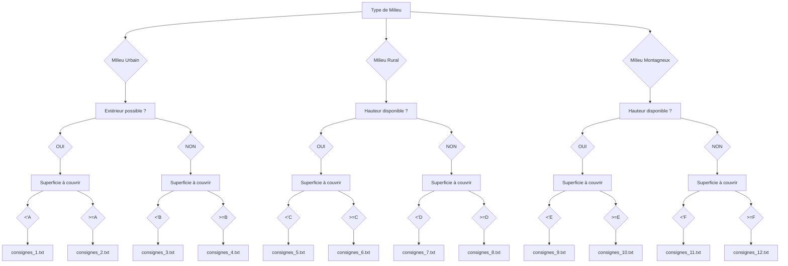

```mermaid
graph TD
    Milieu["Type de Milieu"] 

    Urbain{"Milieu Urbain"}
    Rural{"Milieu Rural"}
    Montagneux{"Milieu Montagneux"}
    
    Milieu --> Urbain
    Milieu --> Rural
    Milieu --> Montagneux

    ExtPossible["Extérieur possible ?"]
    HauteurPossibleRural["Hauteur disponible ?"]
    HauteurPossibleMont["Hauteur disponible ?"]

    Urbain --> ExtPossible
    Rural --> HauteurPossibleRural
    Montagneux --> HauteurPossibleMont

    ExtOui{"OUI"}
    ExtNon{"NON"}
    HautRuralOui{"OUI"}
    HautRuralNon{"NON"}
    HautMontOui{"OUI"}
    HautMontNon{"NON"}

    ExtPossible --> ExtOui
    ExtPossible --> ExtNon
    HauteurPossibleRural --> HautRuralOui
    HauteurPossibleRural --> HautRuralNon
    HauteurPossibleMont --> HautMontOui
    HauteurPossibleMont --> HautMontNon

    SuperficieUrbExt["Superficie à couvrir"]
    SuperficieUrbInt["Superficie à couvrir"]
    SuperficieRuralExt["Superficie à couvrir"]
    SuperficieRuralInt["Superficie à couvrir"]
    SuperficieMontExt["Superficie à couvrir"]
    SuperficieMontInt["Superficie à couvrir"]

    ExtOui --> SuperficieUrbExt
    ExtNon --> SuperficieUrbInt
    HautRuralOui --> SuperficieRuralExt
    HautRuralNon --> SuperficieRuralInt
    HautMontOui --> SuperficieMontExt
    HautMontNon --> SuperficieMontInt

    TaillePetiteUrbExt{"<'A"}
    TailleGrandeUrbExt{">=A"}
    TaillePetiteUrbInt{"<'B"}
    TailleGrandeUrbInt{">=B"}
    TaillePetiteRuralExt{"<'C"}
    TailleGrandeRuralExt{">=C"}
    TaillePetiteRuralInt{"<'D"}
    TailleGrandeRuralInt{">=D"}
    TaillePetiteMontExt{"<'E"}
    TailleGrandeMontExt{">=E"}
    TaillePetiteMontInt{"<'F"}
    TailleGrandeMontInt{">=F"}

    SuperficieUrbExt --> TaillePetiteUrbExt
    SuperficieUrbExt --> TailleGrandeUrbExt
    SuperficieUrbInt --> TaillePetiteUrbInt
    SuperficieUrbInt --> TailleGrandeUrbInt
    SuperficieRuralExt --> TaillePetiteRuralExt
    SuperficieRuralExt --> TailleGrandeRuralExt
    SuperficieRuralInt --> TaillePetiteRuralInt
    SuperficieRuralInt --> TailleGrandeRuralInt
    SuperficieMontExt --> TaillePetiteMontExt
    SuperficieMontExt --> TailleGrandeMontExt
    SuperficieMontInt --> TaillePetiteMontInt
    SuperficieMontInt --> TailleGrandeMontInt

    TaillePetiteUrbExt --> Consignes1["consignes_1.txt"]
    TailleGrandeUrbExt --> Consignes2["consignes_2.txt"]
    TaillePetiteUrbInt --> Consignes3["consignes_3.txt"]
    TailleGrandeUrbInt --> Consignes4["consignes_4.txt"]
    TaillePetiteRuralExt --> Consignes5["consignes_5.txt"]
    TailleGrandeRuralExt --> Consignes6["consignes_6.txt"]
    TaillePetiteRuralInt --> Consignes7["consignes_7.txt"]
    TailleGrandeRuralInt --> Consignes8["consignes_8.txt"]
    TaillePetiteMontExt --> Consignes9["consignes_9.txt"]
    TailleGrandeMontExt --> Consignes10["consignes_10.txt"]
    TaillePetiteMontInt --> Consignes11["consignes_11.txt"]
    TailleGrandeMontInt --> Consignes12["consignes_12.txt"]


```
