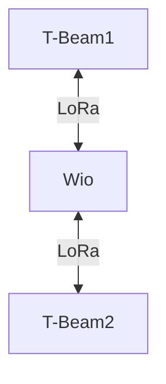

# Tests en milieu montagneux

## 1. Objectif
Évaluer la communication LoRa en milieu montagneux en utilisant des relais et en variant les caractéristiques :
- Superficie à couvrir
- Hauteur
- Utilisation de relais

On utilisera ici des antennes en 868 MHz car elles offrent une meilleure portée en milieu à faible densité.
L'objectif est de déterminer le bon placement des relais.

## 2. Matériel Utilisé
- 2x **T-BEAM Supreme** (ESP32 + LoRa)
- Antennes 868 MHz
- 1x Wio-WM1110
- Connexion Bluetooth avec **API Meshtastic**

## 3. Topologie du Test

## 4. Scénarios de Test  
Les différents scénarios peuvent êtres trouvés dans le fichier `/src/test/images/planification_tests.pdf`

Nos 2 tests permettent de tester les critères décris dans la partie objectif.

Tous les tests ont été effectués de la même manière: 2 endpoints communiquent et l'un avance et on note la distance entre les deux au moment où la communication coupe.

### Premier test
Dans ce test, les deux endpoints commencent en communication directe mais sont rapidement chacun d'un côté de la montagne.

### Deuxième test
Dans ce test, les deux endpoints sont en communication directe avec le relais WIO mais ne peuvent pas communiquer entre eux

## Résultats

|Communication directe|Relai en communication directe|Distance maximale de communication|
|-|-|-|
|NON|NON|Communication impossible|
|NON|OUI|2 000m|

## Conclusions

Les résultats montrent qu’en milieu montagneux, deux endpoints séparés par une montagne ne peuvent pas communiquer directement, même à courte distance. Le relief constitue un obstacle infranchissable pour le signal LoRa, malgré l’utilisation d’antennes longue portée en 868 MHz. L’utilisation d’un relais permet de rétablir la communication, mais uniquement si celui-ci est en visibilité directe avec les deux endpoints. Ainsi, pour garantir une couverture fiable en terrain accidenté, il est essentiel de placer les relais au sommet des montagnes, là où ils peuvent assurer un lien clair entre les différentes zones du réseau.