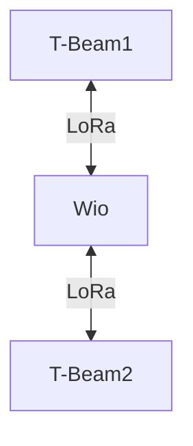

# Tests en milieu rural

## 1. Objectif
Évaluer la communication LoRa en milieu rural en utilisant des relais et en variant les caractéristiques :
- Superficie à couvrir
- Hauteur
- Utilisation de relais

On utilisera ici des antennes en 868 MHz car elles offrent une meilleure portée en milieu à faible densité.
L'objectif est de déterminer le bon placement des relais.

## 2. Matériel Utilisé
- 2x **T-BEAM Supreme** (ESP32 + LoRa)
- Antennes 868 MHz
- 1x Wio-WM1110
- Connexion Bluetooth avec **API Meshtastic**

## 3. Topologie du Test

## 4. Scénarios de Test  
Les différents scénarios peuvent êtres trouvés dans le fichier `/src/test/images/planification_tests.pdf`

Nos 2 tests permettent de tester les critères décris dans la partie objectif.

Tous les tests ont été effectués de la même manière: 2 endpoints communiquent et l'un avance et on note la distance entre les deux au moment où la communication coupe.

### Premier test
Dans ce test, les deux endpoints communiquent d'abord en passant à travers des relais placés au sol.
Le test est ensuite reconduit en mettant les relais en hauteur (en haut d'un arbre ~6m) 

## Résultats

|Relai en hauteur|Distance maximale de communication|
|-|-|
|NON|2 000m|
|OUI|2 500m|

## Conclusions

En milieu rural, les performances de la communication LoRa sont excellentes grâce à la faible densité d’obstacles, avec des portées atteignant déjà 2 km même avec des relais au sol. Toutefois, les résultats montrent qu’en plaçant les relais en hauteur (ici à seulement 6 m) on peut améliorer la portée, jusqu’à 2,5 km. Cela confirme que, dans un environnement ouvert, le principal levier d’optimisation reste la hauteur des relais. Dès que c’est possible, il est donc fortement recommandé de les installer en hauteur (arbres, toits, mâts) pour tirer pleinement parti des capacités de LoRa en zones rurales.