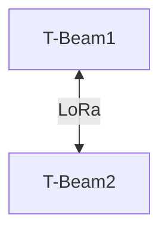

# Tests en milieu urbain

## 1. Objectif
Évaluer la communication LoRa en milieu urbain (forte densité) en variant les caractéristiques :
- Extérieur / Intérieur
- Superficie à couvrir
- Hauteur
- Densité d'immeubles

On utilisera ici des antennes en 433 MHz car elles offrent une meilleure pénétration en milieu dense.

## 2. Matériel Utilisé
- 2x **T-BEAM Supreme** (ESP32 + LoRa)
- Antennes 433 MHz
- Connexion Bluetooth avec **API Meshtastic**

## 3. Topologie du Test

## 4. Scénarios de Test  
Les différents scénarios peuvent êtres trouvés dans le fichier `/src/test/images/planification_tests.pdf`

Nos 6 tests permettent de tester les critères décris dans la partie objectif.

Tous les tests ont été effectués de la même manière: 2 endpoints communiquent et l'un avance et on note la distance entre les deux au moment où la communication coupe.

Tous les tests ont été effectués 2 fois en mettant les antennes à l'intérieur puis à l'extérieur.

### Premier test
Dans ce test, la densité d'immeubles est faible et la hauteur moyenne (8m pour le endpoint 1, 1m pour le endpoint 2).

### Deuxième test
Dans ce test, la densité d'immeubles est moyenne et la hauteur grande (15m pour le endpoint 1, 1m pour le endpoint 2).

### Troisième test
Dans ce test, la densité d'immeubles est forte et la hauteur moyenne (8m pour le endpoint 1, 1m pour le endpoint 2).

## Résultats

|Hauteur|Densité|Extérieur|Distance maximale de communication|
|-|-|-|-|
|Moyenne|Faible|NON|200m|
|Moyenne|Faible|OUI|300m|
|Grande|Moyenne|NON|150m|
|Grande|Moyenne|OUI|250m|
|Moyenne|Forte|NON|50m|
|Moyenne|Forte|OUI|100m|

## Conclusions

Ces tests mettent en évidence les limites pratiques de la technologie LoRa en environnement urbain dense, malgré l'utilisation d’antennes en 433 MHz. On observe une dégradation marquée des performances dans les zones très construites, ce qui souligne l'importance d'adapter l’implantation des nœuds en fonction du terrain. Plutôt que de viser une couverture uniforme, il serait plus pertinent d'envisager une architecture en maillage dense ou l’ajout de relais stratégiques. Cela permettrait de maintenir la fiabilité du réseau même lorsque les conditions ne sont pas idéales, en jouant davantage sur la résilience que sur la portée brute.
