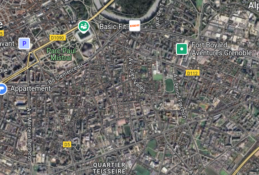
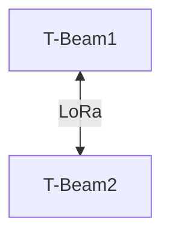
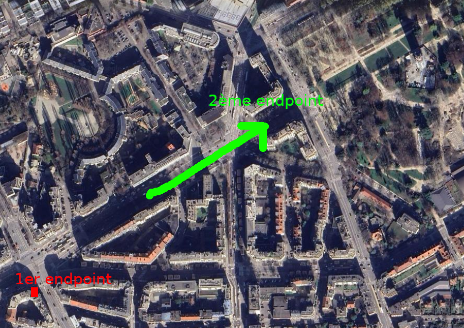

# Tests en milieu urbain

## 1. Objectif
Évaluer la communication LoRa en milieu urbain (forte densité) en variant les caractéristiques :
- Extérieur / Intérieur
- Superficie à couvrir
- Hauteur
- Densité d'immeubles

On utilisera ici des antennes en 433 MHz car elles offrent une meilleure pénétration en milieu dense.

## 2. Matériel Utilisé
- 2x **T-BEAM Supreme** (ESP32 + LoRa)
- Antennes 433 MHz
- Connexion Bluetooth avec **API Meshtastic**

## 3. Topologie du Test

## 4. Scénarios de Test  
Les différents scénarios peuvent êtres trouvés dans le fichier `/src/test/images/planification_tests.pdf`

Nos 6 tests permettent de tester les critères décris dans la partie objectif.

Tous les tests ont été effectués 2 fois en mettant les antennes à l'intérieur puis à l'extérieur.

### Premier test

### **4.1. Test Intérieur - Intérieur** 
#### Situation
- **Résultat attendu** : Forte atténuation du signal due aux murs et aux interférences provenant des appareils électroniques dans un environnement dense.

#### Résultats
| Distance maximale de communication | Hauteur | Densité |
|------------------------------------| --- | --- |
| Communication dans tout Polytech | au sol | Forte |
| Communication dans tout Polytech | 3 étages | Très Forte |

#### Conclusions
La densité élevée de murs dans un environnement intérieur réduit la qualité du signal mais la portée est toujours suffisante pour que 2 EndPoints LoRa puissent communiquer au sein d'un même bâtiment.

### **4.2. Test Intérieur - Extérieur** 

#### Situation
- **Hauteur des antennes** : au sol
- **Densité urbaine** : Modérée 
- **Résultat attendu** : Atténuation du signal à l'intérieur, mais amélioration à l'extérieur où les obstacles sont moins nombreux.

#### Résultats
| Distance maximale de communication |
|---|
| 137m |

#### Conclusions
- Le signal est significativement affaibli à l'intérieur en raison des obstacles physiques, mais l'extérieur permet une portée améliorée.
- Placer l'antenne à l'extérieur est essentiel pour maximiser la portée et la qualité du signal.

---

### **4.3. Test Extérieur - Extérieur** 

#### Situation
- **Résultat attendu** : Meilleure portée grâce à l'élévation des antennes, permettant une meilleure couverture même en présence d'obstacles mineurs.

#### Résultats
| Distance maximale de communication | Densité | Hauteur |
|---|---|---|
| 310 | faible | au sol |
| 200 | forte | au sol |
| 310 | faible | 2 étages |
| 200 | forte | 2 étages |

#### Conclusions
La portée des communications LoRa est fortement influencée par l’environnement et la hauteur des antennes. Une densité élevée (bâtiments, obstacles) réduit la distance de transmission, tandis qu’un environnement dégagé permet une meilleure propagation du signal. L’élévation des antennes ne suffit pas toujours à améliorer la portée si des obstacles restent présents. Pour optimiser la communication, il est essentiel de privilégier des emplacements dégagés avec une bonne ligne de vue.

---
### Conclusion Générale  

Les tests réalisés montrent que la portée des communications LoRa varie en fonction de l’environnement et de la configuration des antennes. En intérieur, les obstacles tels que les murs et les interférences réduisent la qualité du signal, mais la communication reste possible sur l’ensemble d’un bâtiment. En extérieur, la portée s’améliore considérablement, en particulier lorsque la ligne de vue est dégagée.  

Une densité urbaine élevée diminue la distance de transmission en raison des nombreux obstacles, et l’élévation des antennes ne garantit pas toujours une meilleure portée si des obstacles restent présents sur le trajet du signal. Pour optimiser la communication, il est essentiel de choisir des emplacements stratégiques avec un minimum d’obstructions et, si possible, une ligne de vue directe entre les antennes.  
