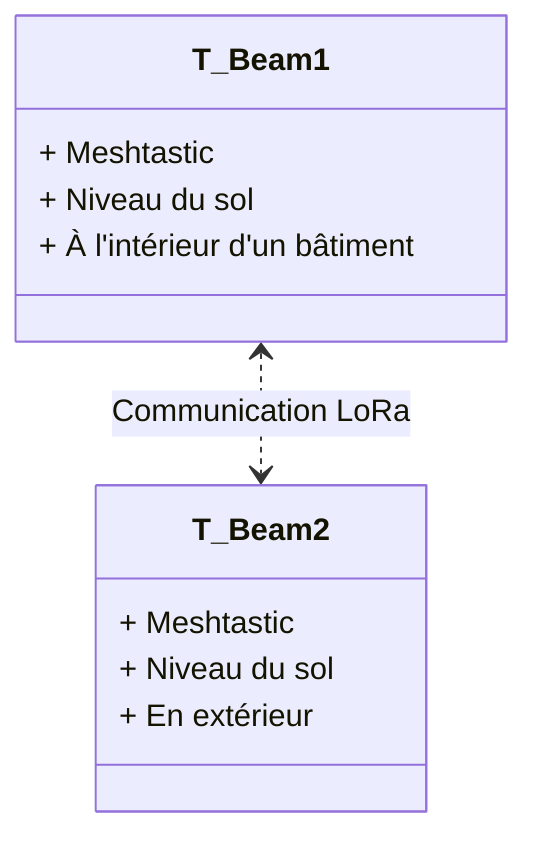

# Premier Test de Portée Meshtastic

## 1. Topologie du Test

## 2. Description de l'Expérience
Ce test vise à évaluer la portée du protocole Meshtastic entre deux modules LoRa dans un environnement urbain dense :
    T-Beam 1 : placé à l'intérieur d'un bâtiment, au niveau du sol.
    T-Beam 2 : positionné en extérieur.

## 3. Résultats Observés
Portée mesurée : 137 m \
Protocole utilisé : Meshtastic \
Densité urbaine : Élevée \
Qualité du lien : Faible \

## 4. Conclusion et Améliorations Possibles

Les résultats montrent que la portée est très limitée lorsque l’un des modules est à l'intérieur et proche du sol. \
A tester : en hauteur en exterieur.
