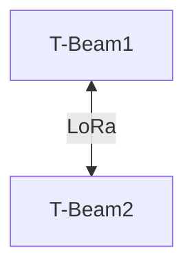

# Test de Communication - 2 T-BEAM Supreme (Topologie Simple)

## 1. Objectif
Évaluer la communication LoRa entre **deux** cartes **T-BEAM Supreme** dans différentes conditions :
- **Intérieur vs Extérieur**
- **Différentes hauteurs d’installation**
- **Impact des obstacles et interférences**

## 2. Matériel Utilisé
- 2x **T-BEAM Supreme** (ESP32 + LoRa)
- Antennes 433 ou 868 MHz
- Connexion Bluetooth avec **API Meshtastic**

## 3. Topologie du Test

---

## 4. Scénarios de Test  
Nous testons trois configurations :

### **4.1. Test Intérieur - Intérieur** 
#### Situation
- **Hauteur des antennes** : 1m (hauteur d'humain)
- **Densité urbaine** : Élevée

#### Résultats
| Distance maximale de communication | Qualité du signal |
|------------------------------------|-------------------|
|                                    |                   | 

#### Conclusions
La densité élevée de bâtiments dans un environnement intérieur réduit considérablement la portée à seulement 137m. \
Il est essentiel d'optimiser la position des antennes et d'augmenter leur hauteur pour minimiser les effets des obstacles urbains et améliorer la couverture.

### **4.2. Test Intérieur - Extérieur** 

#### Situation
- **Hauteur des antennes** : 1m (hauteur d'humain)
- **Densité urbaine** : Modérée (plus d'obstacles à l'intérieur qu'à l'extérieur)
- **Résultat attendu** : Atténuation du signal à l'intérieur, mais amélioration à l'extérieur où les obstacles sont moins nombreux.

#### Résultats
| Distance maximale de communication | Qualité du signal |
|---|---|
| 137m | Moyenne |

#### Conclusions
- Le signal est significativement affaibli à l'intérieur en raison des obstacles physiques, mais l'extérieur permet une portée améliorée.
- Placer l'antenne à l'extérieur est essentiel pour maximiser la portée et la qualité du signal.

---

### **4.3. Test Extérieur - Extérieur** 

#### Situation
- **Hauteur des antennes** : 1m (hauteur d'humain)
- **Densité urbaine** : Faible, avec une ligne de vue dégagée
- **Résultat attendu** : Très bonne portée en raison de l'absence d'obstacles majeurs et de la ligne de vue dégagée.

#### Résultats
| Distance maximale de communication | Qualité du signal |
|---|---|
|  |  |

#### Conclusions
- Dans un environnement extérieur avec une ligne de vue dégagée, la portée peut atteindre jusqu'à 3km avec une qualité de signal optimale.
- Les performances sont idéales dans des zones avec peu d'obstacles et une bonne visibilité entre les antennes.

---

### **4.4. Test Extérieur - Extérieur avec hauteur** 

#### Situation
- **Hauteur des antennes** : 10m pour une antenne et 1m pour l'autre 
- **Densité urbaine** : Faible, avec des obstacles mineurs (quelques arbres)
- **Résultat attendu** : Meilleure portée grâce à l'élévation des antennes, permettant une meilleure couverture même en présence d'obstacles mineurs.

#### Résultats
| Distance maximale de communication | Qualité du signal |
|---|---|
|  |  |

#### Conclusions
- L'augmentation de la hauteur des antennes améliore considérablement la portée et la stabilité du signal.
- Pour des environnements extérieurs, installer les antennes à une hauteur plus élevée permet d'éviter les obstacles et d'étendre la portée de manière significative.

## Conclusion Générale

Les tests effectués sur différentes topologies ont permis de mettre en évidence l'impact significatif de l'environnement sur la portée et la qualité du signal entre les antennes LoRa T-Beam Supreme. 

- **En intérieur**, la portée est fortement réduite en raison des obstacles physiques (murs, meubles) et des interférences, ce qui entraîne une communication moins stable et de moindre portée.
- **À l'extérieur**, la ligne de vue dégagée améliore considérablement la portée, permettant des distances de communication bien plus longues avec une qualité de signal optimale.
- **L'élévation des antennes** en extérieur augmente la portée et la stabilité du signal, même en présence d'obstacles mineurs, offrant ainsi un avantage supplémentaire en termes de couverture.

En conclusion, pour des performances maximales, il est essentiel de privilégier les environnements extérieurs, d'éviter les obstacles physiques et d'augmenter la hauteur des antennes lorsque cela est possible.

